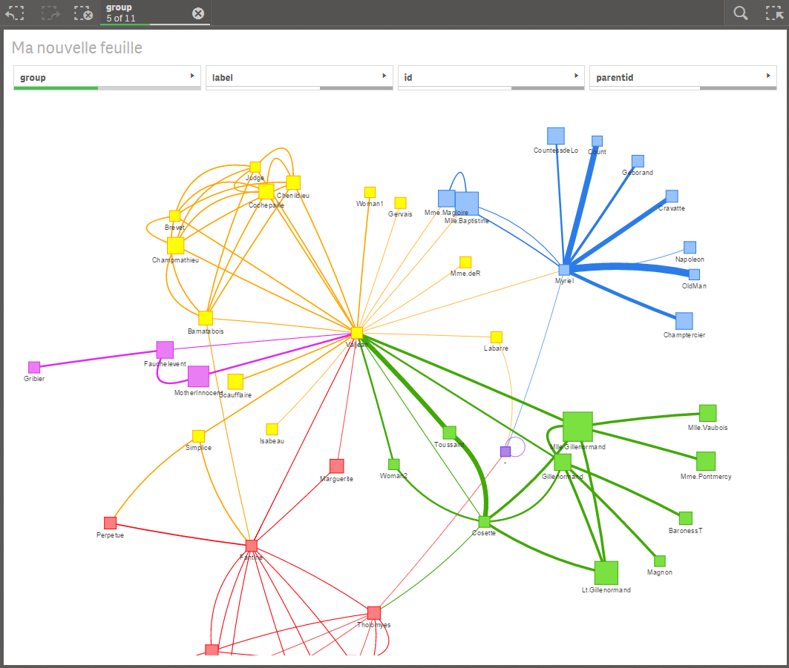

# Qlik Network Chart

Qlik Sense extension to visualize networks data based on library vis.js (http://visjs.org).
Tested with Qlik Sense 2.2.3.

### Dimensions
4 dimensions are mandatory :

  1. node identifier
  2. node label
  3. node parent identifier
  4. node group

### Measures
The measures are optional

  1. tooltip : expression that will be push in the tooltip when hover on a node
  2. node value : used to scale the node size
  3. edge value : used to scale the edge width

### Additional network settings
* Edge Type : select type of curve between nodes
* Node Shape : dot, square, diamond, triangle ...
* Display Edge Value : switch to display the measures on edge curves
* Position Edge Label : top, bottom, middle, horizontal
* Display Shadow : switch to enable shadow effects behind edge and nodes

### Sample
QVF based on characters from Victor Hugo's novel , Les Misérables.

# Getting Started

## Installation

1. Download the extension zip, `qlik-network-chart_<version>.zip`, from the latest release(https://github.com/qlik-oss/network-vis-chart/releases/latest)
2. Install the extension:

   a. **Qlik Sense Desktop**: unzip to a directory under [My Documents]/Qlik/Sense/Extensions.

   b. **Qlik Sense Server**: import the zip file in the QMC.

# Developing the extension

If you want to do code changes to the extension follow these simple steps to get going.

1. Get Qlik Sense Desktop
1. Create a new app and add the extension to a sheet.
2. Clone the repository
3. Run `npm install`
4. Set the environment variable `BUILD_PATH` to your extensions directory. It will be something like `C:/Users/<user>/Documents/Qlik/Sense/Extensions/<extension_name>`.
5. You now have two options. Either run the watch task or the build task. They are explained below. Both of them default to development mode but can be run in production by setting `NODE_ENV=production` before running the npm task.

   a. **Watch**: `npm run watch`. This will start a watcher which will rebuild the extension and output all needed files to the `buildFolder` for each code change you make. See your changes directly in your Qlik Sense app.

   b. **Build**: `npm run build`. If you want to build the extension package. The output zip-file can be found in the `buildFolder`.

# Original Author

**Michael Laenen**

* [github.com/miclae76](https://github.com/miclae76)
